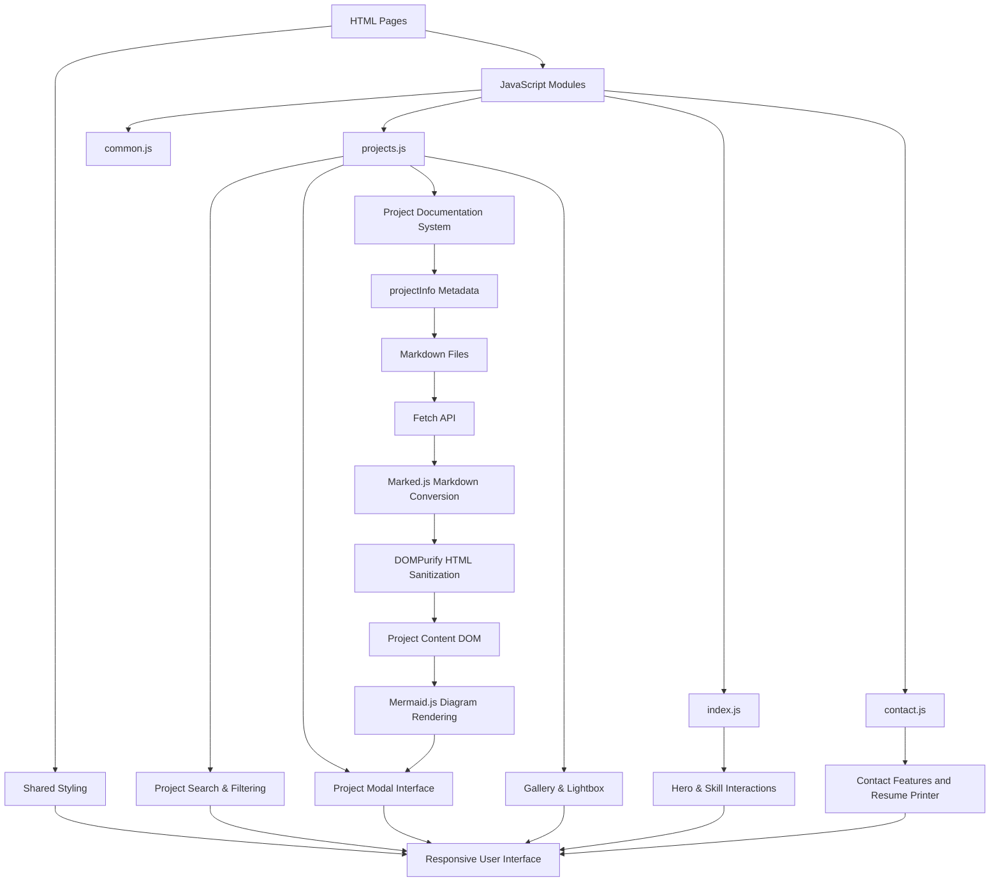

# Engineering Portfolio

**Status:** Active Development

> A custom-built frontend portfolio platform that transforms traditional static resumes into an interactive engineering showcase. The website implements dynamic project rendering, metadata-based filtering, Markdown documentation loading, media galleries, skill-based navigation, and reusable UI components to create a scalable system for presenting technical work.

---

## Table of Contents

- [Project Overview](#project-overview)
  - [What is this?](#what-is-this)
  - [Tech Stack](#tech-stack)
  - [Key Features](#key-features)
  - [Why was this built?](#why-was-this-built)
- [Architecture](#architecture)
- [Design Decisions](#design-decisions)
- [Repository Structure](#repository-structure)
- [Implemented Features](#implemented-features)
- [Future Improvements](#future-improvements)
- [Current Limitations](#current-limitations)
- [Deployment](#deployment)
- [License](#license)

---

# Project Overview

## What is this?

My Engineering Portfolio is a custom-built website designed to showcase my engineering projects, technical skills,
and experience through an interactive web interface rather than relying on a static resume or template. The website
was built from scratch to provide a centralized and structured way to explore my work where my engineering projects
can be searched, filtered, and opened into detailed views containing documentation, images, videos, technical information,
and project-specific resources/links. This portfolio is designed to evolve alongside my engineering work, allowing new
projects and technical experience to be added without restructuring the entire website. Additionally, it serves as a direct
method of communication to others who want to know more about me and get in contact with me through various socials in one place.

## Tech Stack

- **Frontend:** HTML5, CSS3, JavaScript
- **Markdown Rendering:** Marked.js
- **Diagrams:** Mermaid.js
- **HTML Sanitization:** DOMPurify
- **Version Control:** Git & GitHub
- **Development Environment:** Visual Studio Code
- **Deployment:** GitHub Pages

## Key Features

### Project Search and Filtering System

The projects page includes a JavaScript-powered filtering system designed to help users navigate the growing project archive.

Implemented functionality includes:

- Keyword searching across project titles and descriptions
- Filtering projects by technology tags
- Filtering by completion status
- Filtering by project difficulty
- Sorting projects by creation date
- Dynamic updating of visible project cards without refreshing the page

Project metadata is stored alongside each project element, allowing JavaScript to efficiently determine which projects match the
selected filters.

### Project Documentation

Project documentation is separated from the website layout by storing each project's content as external Markdown files alongside structured project metadata inside the JavaScript project information object.

When a project is opened, JavaScript retrieves the corresponding project metadata, loads the associated Markdown documentation file, generates the media gallery, tags, links, and metadata, converts the Markdown content into HTML using Marked.js, sanitizes the generated output using DOMPurify, and renders the final content inside the reusable project modal.

This approach separates content from application logic, allowing project documentation to be updated independently from the website code while maintaining a consistent display structure across all projects.

Each expanded project panel contains:

- A project header with title and date
- An interactive project media gallery system with videos and images
- A full list of major and minor skill tags used in the project
- An expandable and collapsible project description
- Links to project resources

### Skills Showcase

- Skills organized by category
- Interactive skill cards with icons
- Detailed skill descriptions of how skills have been used through modal windows
- Redirect button to projects associated with individual technologies for direct proof

### User Interface

- Responsive layouts using flexible CSS layouts and adaptive sizing
- Sticky navigation bar shared across pages for consistent site navigation
- Hero landing page with animated background movement based on user interaction
- Animated hover states and transitions for cards, buttons, and interactive elements
- Modal-based interfaces for displaying detailed project and skill information
- Image lightbox system for expanding project images in project panel gallery
- Persistent music toggle for background audio controls
- Custom 404 page with embedded fallback content

## Why was this built?

Traditional resumes and static portfolios provide limited space to demonstrate the technical
work behind a project. A list of technologies and project titles can show what was built, but
not how the projects were developed or what they contain. This portfolio was built to provide
a more interactive and detailed way to present engineering work. Each project can have its own
documentation, media, technical details, and external resources while remaining accessible through
a single centralized interface. The website itself also serves as a software project, providing
an opportunity to apply frontend development, UI/UX design, JavaScript programming, content
organization, and version control to a practical application.

---

<details>
<summary>Architecture</summary>
<a name="architecture"></a>

## Architecture



</details>

---

<details>
<summary>Design Decisions</summary>
<a name="design-decisions"></a>

## Implemented Features

### Dynamic Project Documentation Rendering

**Decision:** Project descriptions are stored as external Markdown files linked through the JavaScript project data object and dynamically rendered inside reusable project modals instead of creating separate HTML pages for each project.

**Why:** A traditional portfolio often requires manually creating individual pages or HTML sections for every project, which creates duplicated layouts and increases maintenance complexity. This portfolio separates project content from interface logic by storing project metadata, media, tags, links, and documentation as reusable data structures.

When a user opens a project, the system:

- Retrieves the selected project's metadata from the JavaScript project information object
- Loads the associated Markdown documentation file
- Generates the project gallery, tags, links, and metadata dynamically
- Converts Markdown into HTML using Marked.js
- Sanitizes the generated HTML using DOMPurify
- Inserts the final content into the reusable project modal interface

This creates a scalable documentation system where new projects can be added by creating a structured metadata entry and documentation file rather than manually developing new webpage layouts.

**Trade-off:** Separating documentation into external files requires maintaining references between
project metadata and Markdown files, but it improves maintainability by allowing content updates without
modifying the application logic.

### Metadata-Driven Project Organization

**Decision:** Projects are organized using embedded metadata attributes rather than manually maintaining
separate filtering lists.

**Why:** The project search and filtering system requires a reliable way to identify project properties
such as technologies, difficulty, status, and creation date. Metadata stored alongside each project allows
JavaScript to dynamically evaluate filtering conditions without requiring hardcoded logic for every individual project.

This enables:

- Technology-based filtering
- Difficulty filtering
- Completion status filtering
- Date-based sorting
- Keyword searching

As the project archive grows, new projects can be integrated into the existing filtering system by following the same metadata structure.

**Trade-off:** Maintaining accurate metadata becomes an additional responsibility when adding or updating projects.

### Skills as Evidence-Based Navigation

**Decision:** Skill cards do not only display technologies; they provide direct navigation to
projects demonstrating practical usage of each skill.

**Why:** Listing technical skills without evidence provides limited context. The skill system was
designed to connect claimed abilities with completed work by allowing users to select a technology
and immediately view related projects.

The workflow is:

1. User selects a skill card from the skills section
2. A modal displays information about the skill and how it has been applied
3. The user can navigate directly to the projects page
4. The project filter automatically activates to display projects using that technology

This creates a direct connection between technical skills and supporting project evidence rather
than presenting skills as isolated keywords.

**Trade-off:** Each skill requires accurate project tagging to ensure filtered results remain relevant.

### Secure Client-Side Content Rendering

**Decision:** Dynamically generated project documentation is sanitized before being inserted into the webpage.

**Why:** Project documentation is stored as external Markdown files and loaded dynamically when a user opens a project modal. The website converts this Markdown content into HTML at runtime to support rich documentation features such as headings, lists, code blocks, and diagrams.

Because this generated HTML is inserted directly into the webpage DOM, rendering the content without validation could introduce security risks if unsafe HTML elements, scripts, or attributes were included. To reduce this risk, the website uses DOMPurify as a sanitization layer between Markdown conversion and final display.

The rendering pipeline is:

Markdown File -> Fetch API Request -> Marked.js Markdown Conversion -> DOMPurify HTML Sanitization -> Mermaid.js Diagram Rendering -> Project Modal Rendering

When a project is opened, JavaScript retrieves the associated Markdown file, converts the documentation into HTML using Marked.js, sanitizes the generated output through DOMPurify, processes supported diagrams through Mermaid.js, and inserts the final content into the reusable project modal interface.

This approach allows project documentation to maintain the flexibility of Markdown while reducing the security risks associated with dynamically injecting HTML content. It also keeps documentation separate from application logic, allowing project descriptions to be updated without modifying the website's rendering system.

**Trade-off:** Sanitization restricts certain advanced HTML features that may be useful for customization, requiring project documentation to follow the formatting rules and supported elements allowed by DOMPurify. Additionally, client-side rendering introduces additional processing when opening projects compared to using pre-generated static pages.

### Modular JavaScript Architecture

**Decision:** JavaScript functionality is separated into page-specific modules instead of placing
all logic inside a single script.

**Why:** Different pages require different functionality:

- `common.js` handles shared site-wide features
- `index.js` manages homepage interactions
- `projects.js` controls project loading, filtering, modals, and galleries
- `contact.js` manages contact page functionality

Separating responsibilities reduces code coupling, improves maintainability, and makes future feature development easier.

**Trade-off:** Multiple files require clearer organization and dependency management compared to a single script.

### Content-Code Separation

**Decision:** Project documentation is stored separately from application logic through external
Markdown files rather than embedded directly inside JavaScript.

**Why:** Separating content from code improves maintainability by allowing documentation to evolve
without modifying the rendering system. The website logic remains responsible for displaying and
interacting with projects, while Markdown files act as the source of project-specific documentation.

This separation allows:

- Documentation updates without modifying JavaScript
- Cleaner version control changes
- Easier project expansion
- More readable project metadata files

**Trade-off:** External documentation files require additional file management and dependency paths
between project metadata and documentation.

</details>

---

<details>
<summary>Repository Structure</summary>
<a name="repository-structure"></a>

## Repository Structure

The project is organized to separate website structure, styling, application logic, documentation, and media assets.

```text
.
├── index.html
├── projects.html
├── contact.html
├── 404.html
│
├── style.css
│
├── javascript/
│ ├── common.js
│ ├── index.js
│ ├── projects.js
│ └── contact.js
│
├── markdown/
│ ├── ad-lab.md
│ ├── eng.md
│ ├── simon-says-v2.md
│ ├── code-atlas.md
│ └── ...
│
├── images/
│ └── ...
│
├── videos/
│ └── ...
│
├── audio/
│ └── ...
│
├── LICENSE
│
└── README.md
```

### Directory Responsibilities

**HTML Pages**

Contains the static webpage structure and navigation between portfolio sections.

**CSS**

Contains global styling, responsive layouts, animations, and reusable visual components.

**JavaScript**

Contains page-specific functionality:

- `common.js` - Shared website functionality
- `index.js` - Homepage interactions and animations
- `projects.js` - Project loading, filtering, modals, and galleries
- `contact.js` - Contact page functionality

**Markdown**

Contains individual project documentation files loaded dynamically.

**Media (images/ and audio/)**

Stores project images, videos, and additional portfolio assets.

</details>

---

<details>
<summary>Implemented Features</summary>
<a name="implemented-features"></a>

## Implemented Features

### Project Management System

- [x] Dynamic project loading through metadata objects
- [x] External Markdown documentation support
- [x] Project media galleries
- [x] Project tags and technology tracking
- [x] External resource linking
- [x] Reusable project modal interface

### Search and Filtering

- [x] Keyword searching
- [x] Technology-based filtering
- [x] Completion status filtering
- [x] Difficulty filtering
- [x] Creation date sorting
- [x] URL-based skill filtering

### Documentation System

- [x] Markdown file loading through Fetch API
- [x] Markdown-to-HTML conversion
- [x] Mermaid diagram rendering
- [x] HTML sanitization through DOMPurify
- [x] Expandable project descriptions

### Skills System

- [x] Categorized technical skills
- [x] Interactive skill cards
- [x] Skill detail modals
- [x] Direct navigation from skills to supporting projects

### User Interface

- [x] Responsive layouts
- [x] Animated interface elements
- [x] Shared navigation system
- [x] Modal-based project viewing
- [x] Image lightbox system
- [x] Custom 404 page
- [x] Background audio controls
- [x] Hero page parallax background

### Development Practices

- [x] Modular JavaScript architecture
- [x] Git-based version control
- [x] External documentation management
- [x] Component-style reusable interfaces

</details>

---

<details>
<summary>Future Improvements</summary>
<a name="future-improvements"></a>

## Future Improvements

### Content Management

- [ ] Move project metadata into separate JSON files
- [ ] Create automated project indexing
- [ ] Develop a simplified project creation workflow

### Performance Optimization

- [ ] Lazy loading for project media
- [ ] Image compression pipeline
- [ ] Improved asset optimization
- [ ] Reduce initial JavaScript loading requirements

### User Experience

- [ ] Even more advanced project search functionality
- [ ] Additional accessibility improvements for multiple languages
- [ ] Theme and animation customization options
- [ ] Improved mobile navigation
- [ ] An SSH terminal viewer?

### Engineering Features

- [ ] Interactive project timeline
- [ ] Project comparison system
- [ ] Analytics dashboard
- [ ] Automated project statistics
- [ ] More advanced filtering capabilities

</details>

---

<details>
<summary>Limitations / Known Issues</summary>
<a name="limitations--known-issues"></a>

## Current Limitations

- Project metadata and Markdown file references must currently be maintained manually.
- Client-side rendering requires JavaScript to be enabled.
- Large numbers of projects may require additional optimization for filtering performance.
- Media assets are currently stored directly inside the repository.
- GitHub Pages deployment limits backend functionality.
- Markdown documentation must follow the supported formatting rules allowed by DOMPurify.

## Repository Management Considerations

As the project grows, additional automation may be required for:

- Project metadata validation
- Broken link detection
- Missing asset detection
- Documentation consistency checks

</details>

---

<details>
<summary>Deployment</summary>
<a name="deployment"></a>

## Deployment

This portfolio is deployed using GitHub Pages as a static frontend application.

Deployment workflow:

1. Changes are committed to the GitHub repository.
2. GitHub Pages builds and publishes the static website.
3. HTML, CSS, JavaScript, Markdown documentation, and media assets are served publicly.

Deployment requirements:

- Static hosting support
- JavaScript execution support
- Access to repository assets

Current deployment:

[View the live portfolio](https://Cir9no-0001.github.io/engineering-portfolio/)

</details>

---

## License

This project is proprietary software and is **not open source**.

Copyright (c) 2026 Stanley Chen

All Rights Reserved.

The source code, documentation, assets, and associated materials contained within this repository are the exclusive property of Stanley Chen.

This repository is publicly available for viewing, educational evaluation, and code review purposes only. No permission is granted to copy, modify, distribute, sublicense, publish, commercially use, or create derivative works from this project without explicit written permission.

See [LICENSE](LICENSE) for the full terms.
