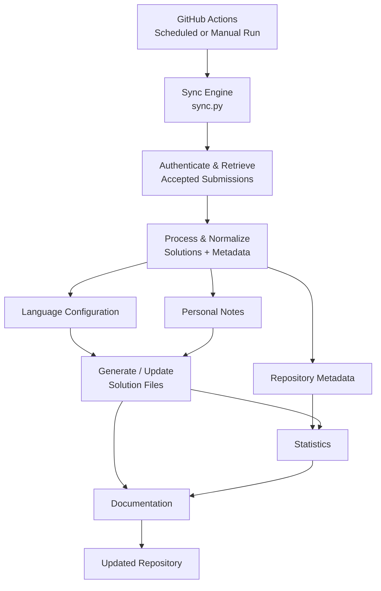

# Project Overview

## What is this?

CodeAtlas is an automated solution archive designed to synchronize accepted LeetCode submissions into a structured repository.

Instead of manually copying solutions, organizing files, tracking metadata, and maintaining documentation, this project automates the process through GitHub Actions and the LeetCode GraphQL API.

CodeAtlas currently supports multiple programming languages and automatically:

- Retrieves accepted LeetCode submissions
- Creates and organizes solution files by difficulty and language
- Tracks solution metadata and timestamps
- Maintains separate personal notes and explanations
- Applies language-specific file extensions and comment syntax
- Generates repository statistics
- Keeps documentation synchronized with the repository

The long-term goal is to transform a simple solution archive into a continuously improving platform for analyzing, organizing, and exploring programming solutions.

## Tech Stack

- **Language:** Python 3.12
- **API Integration:** LeetCode GraphQL API
- **CI/CD:** GitHub Actions (scheduled + manual workflow dispatch)
- **Data Persistence:** JSON (metadata, notes, statistics)
- **Language Configuration:** Python configuration mapping LeetCode languages to file extensions and comment syntax
- **Dependencies:** `requests`
- **Standard Library:** `zoneinfo` (timezone-aware timestamps), `json`, `os`
- **Version Control Automation:** Git (automated commits via GitHub Actions bot identity)

## Key Features

### Automated Synchronization

- Automatically retrieves accepted LeetCode submissions
- Generates organized solution files
- Runs through GitHub Actions
- No manual copying required

### Documentation System

- Personal notes stored separately
- Notes automatically injected into solutions
- Preserves original submission code

### Repository Management

- Automatic statistics generation
- Metadata tracking
- Solution organization
- README auto-updates

## Why was this built?

Learning software engineering often creates a documentation problem.

Developers build projects, learn new technologies, and solve problems, but the evidence of that growth becomes scattered across repositories, notes, and forgotten experiments.

CodeAtlas was created to solve this problem by automatically capturing progress, organizing solutions, and preserving the reasoning behind the code.

This project started as a 3:00 AM SYDEquest from a Python API-handling tutorial hell on a scuffed idea to automatically save and organize my LeetCode SQL progress without having to maintain files manually.

Over time, it evolved into a larger system focused on separating:

- The original solution code
- Personal learning notes
- Generated metadata
- Future analysis features

This allows solutions to remain unchanged while documentation, complexity analysis, tagging, and other features can continue improving after the solution is created.

---

## Architecture



---

## Repository Structure

```text
.
├── sync.py
├── language_config.py
├── requirements.txt
├── leetcode_meta.json
├── leetcode_notes.json
├── leetcode_stats.json
├── README.md
├── README.template.md
├── CHANGELOG.md
├── VERSION.md
├── LICENSE
├── .gitignore
│
└── leetcode/
    ├── easy/
    │   ├── {problem-slug}.{extension}
    │   └── ...
    │
    ├── medium/
    │   ├── {problem-slug}.{extension}
    │   └── ...
    │
    └── hard/
        ├── {problem-slug}.{extension}
        └── ...
```

---

## Design Decisions

### Why Separate Notes From Solutions?

**Decision:** Solution code and personal documentation are stored in separate layers rather than as comments inside the submission itself.

- `{problem-slug}.{extension}` files - the submitted solution code and generated metadata (title, difficulty, timestamps, runtime)
- `leetcode_notes.json` - personal hints, explanations, and complexity notes
- `leetcode_meta.json` - generated repository metadata

**Why:** A common approach is writing notes directly into the LeetCode submission before solving. This project deliberately avoids that, so documentation can keep improving after a problem is solved without ever touching the original, already-submitted code - and so future automated analysis (complexity detection, pattern tagging, AI-assisted explanations - see [Incoming Features](#incoming-features)) has a clean layer to build on rather than parsing free-text comments out of code.

**Trade-off:** This adds a synchronization step where notes have to be correctly matched back to their solution file on every run, rather than using the simpler but less durable approach of directly editing the submission comment.

### Repository as the Source of Truth

**Decision:** The repository's own files are treated as ground truth, not the LeetCode API.

**Why:** Statistics are computed by counting existing supported files on disk rather than trusting a running counter or re-querying the API. If LeetCode's API changes or synchronization temporarily breaks, the repository stays accurate and functional on its own.

**Trade-off:** Solution filenames are derived from the problem title, while metadata/notes are keyed by LeetCode's slug. These are expected to match but aren't strictly guaranteed to, a known constraint to keep in mind if problem titles ever contain unusual formatting.

### Credential Security

**Decision:** Authentication is handled entirely through GitHub Actions Secrets, never committed to source control.

**Why:** `LEETCODE_SESSION` and `LEETCODE_USERNAME` are injected as environment variables at runtime. Keeping credentials out of the repository entirely removes an entire class of accidental-exposure risk (no history to scrub, nothing to `.gitignore` correctly, nothing to accidentally push).

### Minimizing Unnecessary Repository Changes

**Decision:** Files are only written when their content actually changes.

**Why:** Generated output is diffed against the existing file before any write. This keeps the commit history meaningful (a commit means something actually changed), avoids triggering unnecessary downstream GitHub Actions runs, and reduces disk I/O on every sync.

### Centralized Language Configuration

**Decision:** Language-specific file extensions and comment syntax are stored in `language_config.py` rather than being hardcoded throughout `sync.py`.

The configuration maps each supported LeetCode language to the information required to generate and maintain its solution files, including:

- File extension
- Single-line comment syntax
- Multiline comment delimiters where supported

**Why:** Supporting multiple languages requires the synchronization engine to understand how each language should be represented on disk. Keeping this information in one configuration module prevents language-specific rules from being duplicated across functions such as solution generation, notes formatting, extension repair, and statistics collection.

This also makes adding another language a localized change: the language mapping can be extended without rewriting the synchronization logic.

**Trade-off:** `sync.py` depends on the configuration being complete and internally consistent. An unsupported language or missing comment syntax causes the synchronization process to reject that language rather than generating an incorrectly formatted solution file.

### Independent Solutions Per Language

**Decision:** Solutions for the same LeetCode problem are treated as independent repository entries when they use different programming languages.

For example:

```text
two-sum.py
two-sum.cpp
```

represent two separate solution records rather than two versions of the same record.

The solution key is therefore based on the LeetCode problem slug together with the language-specific file extension:

{titleSlug}{extension}

This allows the same problem to exist independently across supported languages while preserving separate code, runtime information, and metadata.

**Why:** A solution written in Python and a solution written in C++ are different implementations with potentially different algorithms, complexity characteristics, runtime performance, and language-specific syntax. Treating them as one record would make it difficult to preserve that information independently.

**Trade-off:** The repository can contain multiple files for the same LeetCode problem, increasing the number of tracked solution files. This is intentional because the statistics represent stored solution implementations rather than only unique LeetCode problems.

---

## Example: Generated Solution File

`leetcode/easy/find-users-with-valid-e-mails.sql`

```sql
-- Find Users With Valid E-Mails
-- https://leetcode.com/problems/find-users-with-valid-e-mails
-- difficulty: easy
-- first_seen: 2026-08-01 20:11:01 EDT
-- runtime: 744ms

/_
Notes:
Hint: use regexp_like to get case sensitivity for the suffix, or use an extra
like binary. Watch out for the period in the suffix, which is a wildcard, so
put it in square brackets. [TC: O(N), 1 pass]
_/

select _
from Users u
where regexp*like(u.mail, '^[a-zA-Z]a-zA-Z0-9.*-]_@leetcode[.]com$', 'c')

```

Every field above is generated automatically by `sync.py`: the header
(title, URL, difficulty, timestamp, runtime) and the code are written by
the sync engine on each run. The `Notes` block is the one exception as it's
independently maintained in `leetcode_notes.json` and re-injected into the
file without touching the surrounding code or header, so documentation can
keep improving without ever risking the submitted solution itself.

Solution files are language-specific. The same LeetCode problem may therefore
appear as multiple independent files, such as `two-sum.py`, `two-sum.cpp`, or
`two-sum.java`, when solutions have been submitted in different languages.
