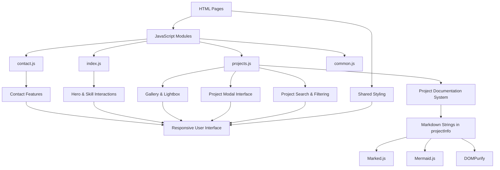

# Project Overview

## What is this?

My Engineering Portfolio is a custom-built website designed to showcase my engineering projects, technical skills,
and experience through an interactive web interface rather than relying on a static resume or template. The website
was built from scratch to provide a centralized and structured way to explore my work where my engineering projects
can be searched, filtered, and opened into detailed views containing documentation, images, videos, technical information,
and project-specific resources/links. This portfolio is designed to evolve alongside my engineering work, allowing new
projects and technical experience to be added without restructuring the entire website. Additionally, it serves as a direct
method of communication to others who want to know more about me and get in contact with me through various socials in one place.

## Tech Stack

- **Frontend:** HTML5, CSS3, JavaScript
- **Markdown Rendering:** Marked.js
- **Diagrams:** Mermaid.js
- **HTML Sanitization:** DOMPurify
- **Version Control:** Git & GitHub
- **Development Environment:** Visual Studio Code
- **Deployment:** GitHub Pages

## Key Features

### Project Search and Filtering System

The projects page includes a JavaScript-powered filtering system designed to help users navigate the growing project archive.

Implemented functionality includes:

- Keyword searching across project titles and descriptions
- Filtering projects by technology tags
- Filtering by completion status
- Filtering by project difficulty
- Sorting projects by creation date
- Dynamic updating of visible project cards without refreshing the page

Project metadata is stored alongside each project element, allowing JavaScript to efficiently determine which projects match the
selected filters.

### Project Documentation

Project documentation is separated from the website layout by storing each project's content as structured
data inside the JavaScript project information object. When a project is opened, JavaScript retrieves the
corresponding project data, generates the media gallery, tags, links, and metadata, converts the Markdown
description into HTML using Marked.js, sanitizes the output using DOMPurify, and renders the final content
inside the reusable project modal.

This approach allows every project to follow the same display structure while maintaining unique
documentation, media, technical details, and resources without creating separate HTML pages.

Each expanded project panel contains:

- A project header with title and date
- An interactive project media gallery system with videos and images
- A full list of major and minor skill tags used in the project
- An expandable and collapsible project description
- Links to project resources

### Skills Showcase

- Skills organized by category
- Interactive skill cards with icons
- Detailed skill descriptions of how skills have been used through modal windows
- Redirect button to projects associated with individual technologies for direct proof

### User Interface

- Responsive layouts using flexible CSS layouts and adaptive sizing
- Sticky navigation bar shared across pages for consistent site navigation
- Hero landing page with animated background movement based on user interaction
- Animated hover states and transitions for cards, buttons, and interactive elements
- Modal-based interfaces for displaying detailed project and skill information
- Image lightbox system for expanding project images in project panel gallery
- Persistent music toggle for background audio controls
- Custom 404 page with embedded fallback content

## Why was this built?

Traditional resumes and static portfolios provide limited space to demonstrate the technical
work behind a project. A list of technologies and project titles can show what was built, but
not how the projects were developed or what they contain. This portfolio was built to provide
a more interactive and detailed way to present engineering work. Each project can have its own
documentation, media, technical details, and external resources while remaining accessible through
a single centralized interface. The website itself also serves as a software project, providing
an opportunity to apply frontend development, UI/UX design, JavaScript programming, content
organization, and version control to a practical application.

---

# Architecture

---

## Design Decisions

### Dynamic Project Documentation Rendering

**Decision:** Project descriptions are stored as structured Markdown strings inside the JavaScript
project data object and dynamically rendered inside reusable project modals instead of creating
separate HTML pages for each project.

**Why:** A traditional portfolio often requires manually creating individual pages or HTML sections
for every project, which creates duplicated layouts and increases maintenance complexity. This portfolio
separates project content from the interface structure by storing project information, media, tags, links,
and documentation as reusable data objects.

When a user opens a project, the system:

- Retrieves the selected project's data from the JavaScript project information object
- Generates the project gallery, tags, links, and metadata dynamically
- Converts the Markdown description into HTML using Marked.js
- Sanitizes the generated HTML using DOMPurify
- Inserts the final content into the reusable project modal interface

This creates a scalable documentation system where new projects can be added by creating a structured
project entry rather than manually developing new webpage layouts.

**Trade-off:** Storing documentation inside JavaScript increases the size of the project script and
requires updating the source code when adding new projects, but it allows all project rendering logic
and content management to remain centralized within the existing frontend architecture.

### Metadata-Driven Project Organization

**Decision:** Projects are organized using embedded metadata attributes rather than manually maintaining
separate filtering lists.

**Why:** The project search and filtering system requires a reliable way to identify project properties
such as technologies, difficulty, status, and creation date. Metadata stored alongside each project allows
JavaScript to dynamically evaluate filtering conditions without requiring hardcoded logic for every individual project.

This enables:

- Technology-based filtering
- Difficulty filtering
- Completion status filtering
- Date-based sorting
- Keyword searching

As the project archive grows, new projects can be integrated into the existing filtering system by following the same metadata structure.

**Trade-off:** Maintaining accurate metadata becomes an additional responsibility when adding or updating projects.

---

### Skills as Evidence-Based Navigation

**Decision:** Skill cards do not only display technologies; they provide direct navigation to
projects demonstrating practical usage of each skill.

**Why:** Listing technical skills without evidence provides limited context. The skill system was
designed to connect claimed abilities with completed work by allowing users to select a technology
and immediately view related projects.

The workflow is:

1. User selects a skill card from the skills section
2. A modal displays information about the skill and how it has been applied
3. The user can navigate directly to the projects page
4. The project filter automatically activates to display projects using that technology

This creates a direct connection between technical skills and supporting project evidence rather
than presenting skills as isolated keywords.

**Trade-off:** Each skill requires accurate project tagging to ensure filtered results remain relevant.

### Secure Client-Side Content Rendering

**Decision:** Dynamically generated project documentation is sanitized before being inserted into the webpage.

**Why:** Project descriptions are stored as Markdown strings inside the JavaScript project data object
and converted into HTML when a user opens a project modal. Since generated HTML is inserted into the DOM
dynamically, directly rendering the output could introduce security risks if unsafe content is included.

The rendering pipeline is:

Markdown String → Marked.js HTML Conversion → DOMPurify Sanitization → Modal Rendering

DOMPurify acts as a security layer by filtering potentially unsafe HTML elements and attributes before
the content is displayed to users. This allows project documentation to support rich formatting such as
headings, lists, code blocks, and diagrams while reducing the risks associated with dynamic HTML injection.

**Trade-off:** Sanitization limits certain HTML features that may be useful for advanced customization,
requiring documentation to follow the allowed formatting rules supported by the sanitizer.

### Modular JavaScript Architecture

**Decision:** JavaScript functionality is separated into page-specific modules instead of placing
all logic inside a single script.

**Why:** Different pages require different functionality:

- `common.js` handles shared site-wide features
- `index.js` manages homepage interactions
- `projects.js` controls project loading, filtering, modals, and galleries
- `contact.js` manages contact page functionality

Separating responsibilities reduces code coupling, improves maintainability, and makes future feature development easier.

**Trade-off:** Multiple files require clearer organization and dependency management compared to a single script.
